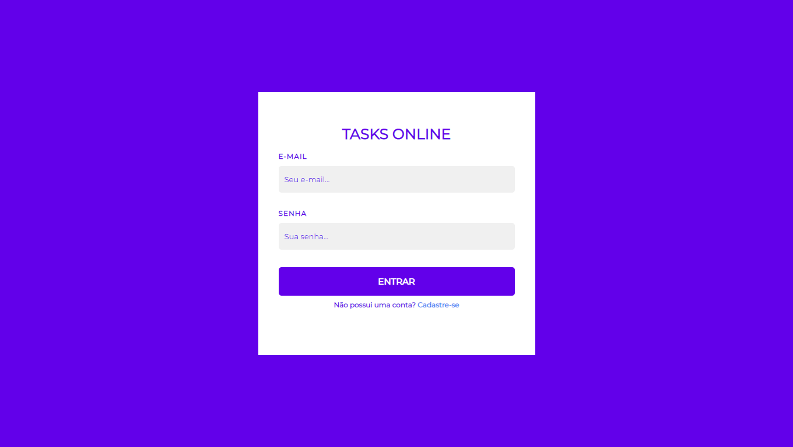

<h1 align="center">
  Tasks Online 
</h1>

<h3 align="center">
    Sistema para gerenciamento de tarefas (to-do) online.
</h3>

## :computer: Rodando o servidor

:bulb: Execute o servidor na linha de comando apenas digitando o seguinte comando:

```
php -S localhost:8080
```

Agora você pode acessar o link no navegador e ver o aplicativo rodando.


